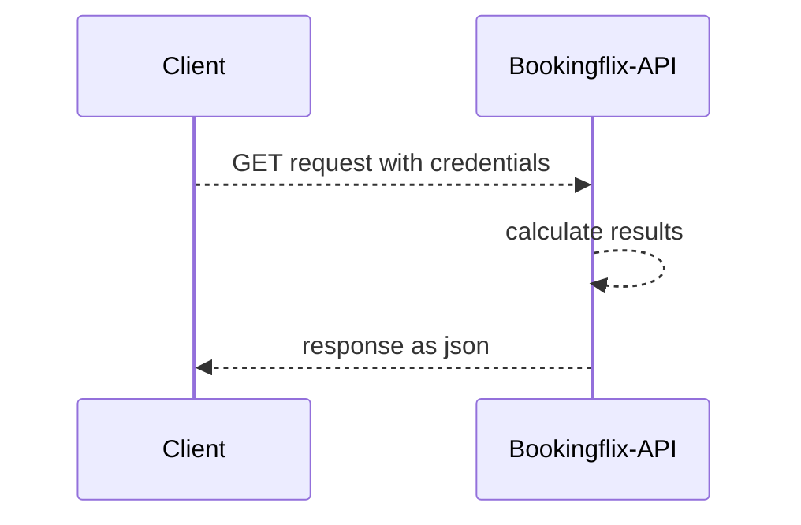

# Bookingflix API-SDK

Es ist möglich Anfragen an die Bookingflix-API zu senden, um Terminbuchungen des eigenen Kalenders serverseitig abzugreifen und im eigenen Workflow weiterzuverarbeiten.



Für die Anfragen werden folgende Credentials benötigt.

### Credentials

```
SECRET_URL
ACCESS_TOKEN
CALENDAR_ID
```

## Body-Attribute

Weiterhin wird das Body-Attribut `range` benötigt, um den Zeitrahmen der Termine einzugrenzen. So können gefilterte Datenabfragen erfolgen.

```JSON
{
  "range": {
    "from": "2023-01-01",
    "to": "2023-12-31"
  }
}
```

## Response

Zurückgegeben wird ein Array mit Objekten aller zugesagten und verifizierten Termindaten nach folgendem Schema:

```JSON

[{"submit_date":"2023-04-19 14:59:26","appointment_begin":"2023-05-13 15:00:00","appointment_end":"2023-05-13 18:00:00","client_email":"demo@demo.com","client_tel":"","group_booking":"1","submitted_form_data":{"Email":"demo@demo.com","Text":"Meine Kundennummer 1234567"},"booked_service":""},{...}]

```


> Das Objekt der `submitted_form_data` beinhaltet alle Eingaben des Terminbuchungsformulars als key-value-Paar.

## Code-Beispiele

Im Ordner `examples` befinden sich Code-Beispiele für verschiedene Programmiersprachen.